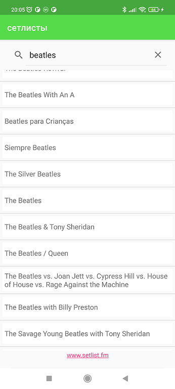
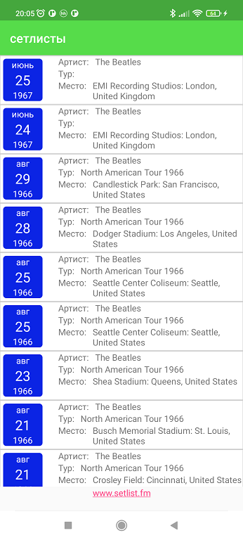
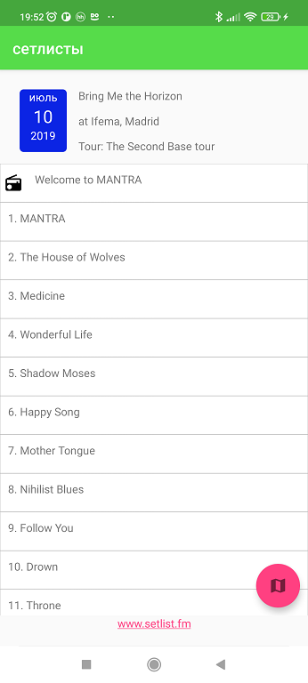
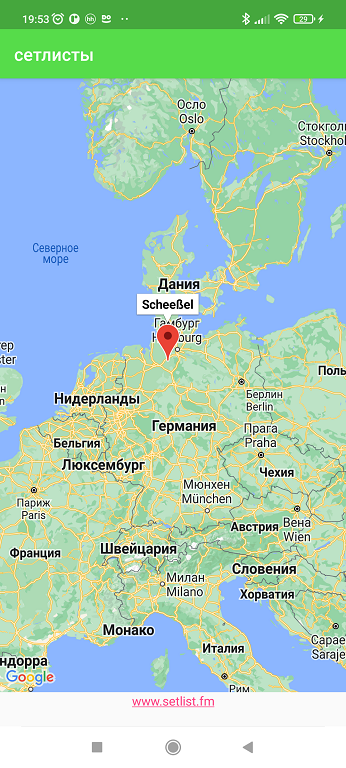

Setlist-mobile
===============

Приложение для просмотра сетлистов(списка песен) с прошедших концертов. 

С помощью данного приложения можно найти либого (или почти любого) музыканта или группы и посмотреть, какие песни они играли на 

каждом прошедшем концерте. Приложение является бесплатным и разрабатывается с целью обучения и совершенствования навыков программирования.

.apk файл приложения находития в папке apk

 
 

API
-----

Вся информация об исполнителях, сетлистах и песня берется c https://www.setlist.fm/ с помощью API. 

Технологии
-----------

Приложение написано на Kotlin, архитектура строится на паттерне MVVM. 

Для доступа к API сайта https://www.setlist.fm/ используется библиотека Retrofit.

Хранение данных в БД реализовано с помощью Room и RxJava

DI реализован с помощью библиотеки Dagger.

Планируемые обновления
-------------------------

1. Сохранение всей информации в БД для использования приложения без доступа к сети

2. Отображение геолокации прошедшего концерта на карте с помощью библиотек и API Google